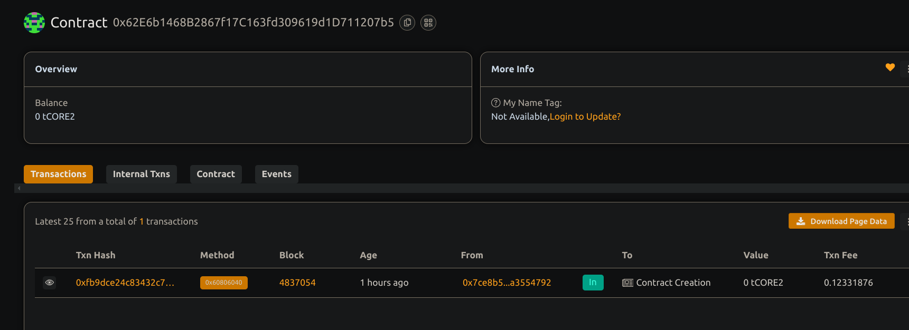

# NFT Marketplace with Royalty Distribution

## 📖 Project Description

This project is a decentralized  NFT marketplace built on Solidity using Hardhat. It allows users to mint NFTs, list them for sale,  and receive automatic royalty distributions upon resale.

## 🌍 Project Vision

The vision  is to empower creators by ensuring they are fairly rewarded with royalties for every resale of their digital assets, all while maintaining full transparency and decentralization.

## 🔑 Key Features

- ERC721 NFT minting with metadata support
- NFT listing and purchasing on-chain
- Royalty distribution to  creators
- Marketplace fee for  platform  sustainability
- Core Testnet 2 deployment support

## 🚀 Future Scope

- Add bidding mechanism for  auctions
- Allow ERC20 payments
- Metadata hosting on IPFS
- Frontend DApp integration
- Creator analytics dashboard

## Contract details
0x62E6b1468B2867f17C163fd309619d1D711207b5
